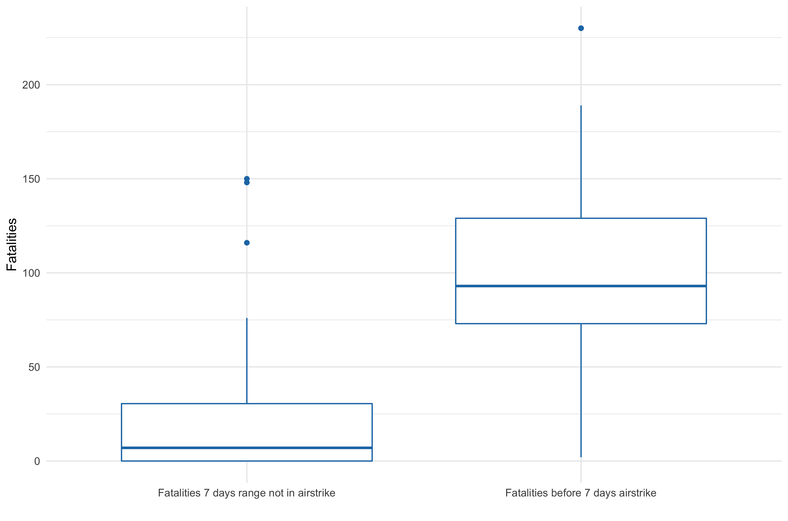

POST-COUP CONFLICT: BLOODSHED AND WARFARE
================

## File Directory

-   *assets*
-   airstrike.R
-   analysis.R
-   preprocessing.R
-   visualization.R

Run the R script in following order. preprocessing.R \> airstrike.R \>
analysis.R \> visualization.R

You may need internet access to download the require libraries.

*assets* folder include all of the visualizations used in the paper and
GitHub documentation.

### Scripts

**preprocessing.R** - You need to have your own ACLED data on your
machine and point the path in the script. `snr.path` is to normalize the
sub-regions to states and regions.

**airstrike.R** - This script create multiple data frames to be used in
further scripts. Only state and region based analysis are available in
the paper, but this script includes nationwide analysis.

**analysis.R** - Analysis for total fatalities, Pyu Saw Htee associated
events, military airstrikes on civilians and D-Day summary.

**visualization.R** - Process of creating all of the visualization in
the paper.

## Myanmar

About Myanmar

Myanmar is a country located in South East Asia. Hundreds of ethnic
minorities living together with prolong conflicts under centralized
legislature. Discrimination and oppression on minorities persist under
every government including previous authoritarians, elected government
(NLD) and current military (coup) junta.

Administrative geographical division of the 8 major ethnics divided into
7 states and 7 regions. Following is the table of state and regions.
(*Naypyitaw, an administrative division, is not in any of those region*)

States and Regions

| States  | Region     |
|---------|------------|
| Kachin  | Ayeyarwady |
| Kayah   | Bago       |
| Kayin   | Magway     |
| Chin    | Mandalay   |
| Mon     | Sagaing    |
| Rakhine | Taninthary |
| Shan    | Yangon     |

## Boxplot

Boxplot explanation

Boxplot render the *median*, *interquartile range*, and the *outliers*
of the data distribution.

-   **Median** is the middle point in the dataset
-   **Interquartile range** is the first quarter point and third quarter
    point in the dataset.
-   **Outliers** are the points deviated from most of the data in the
    dataset.

For example, comparing the distribution of **Fatalities in armed clashes
7 days before airstrike** and **Fatalities in armed clashes in 7 days
not in airstrike range** in Sagaing region.
 In the boxplot, we can see that most of
the fatalities in armed clashes 7 days before the airstrike is between
about 75 fatalities and 130 fatalities. But most of the fatalities in
armed clash 7 days not in the airstrike is between 0 and 30 fatalities.
Meaning the higher the fatalities in armed clashes in 7 days, the more
chance airstrike to come.

